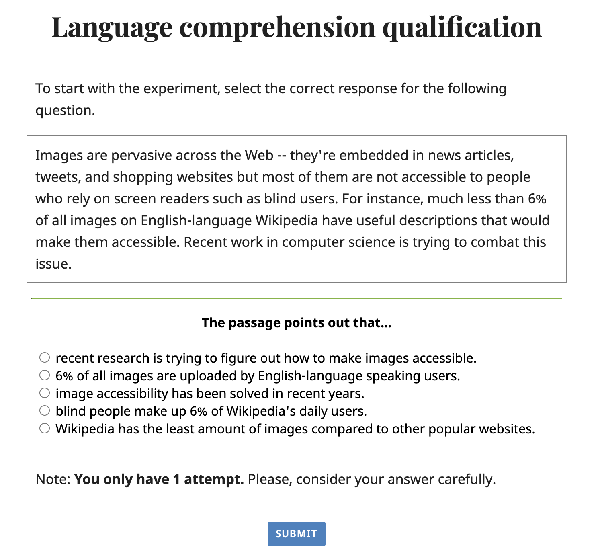
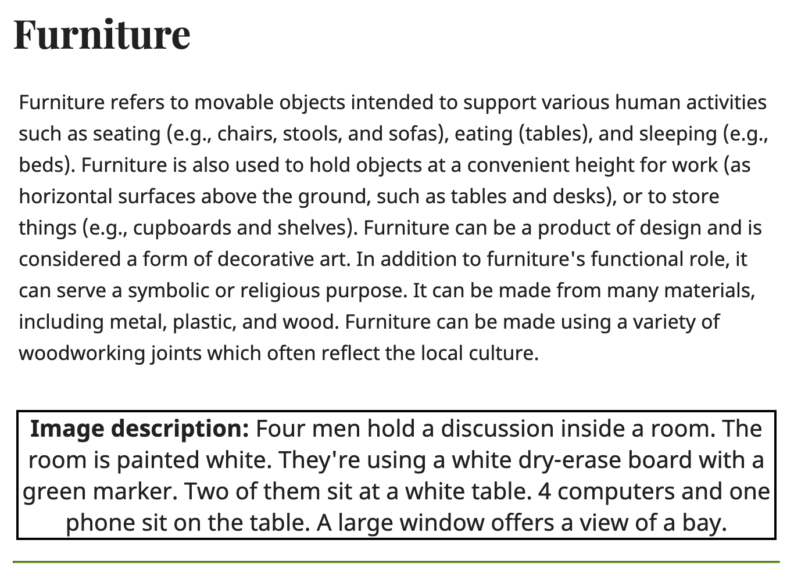
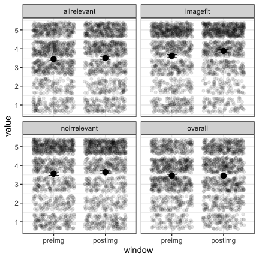

Description Evaluation Study (Sighted Participants)
================

# Experiment

The experiment can be accessed
[here](https://elisakreiss.github.io/contextual-description-evaluation/behavioral_experiments/evaluation_sighted/index.html).

### Language comprehension qualification:

comprehension task formuation

\[To start with the experiment, select the correct response for the
following question.\]

<!-- {width=50%} -->

### Trial setup

trial setup showing context and description

<!-- {width=75%} -->

\[Example display showing the title “Furniture” with the article on
Furniture below it and an image description.\]

Questions:

1.  Imagefit: “How well do you understand why the image occurs in this
    article?” (Not well – Very well)
2.  Reconstructivity (only asked before viewing the image): “How well
    can you imagine this image in your mind?” (Not well – Very well)
3.  Allrelevant: “How well does the description capture the relevant
    aspects of the image?” (Not well – Very well)
4.  Noirrelevant: “Does the description mention too much irrelevant
    information for accessibility needs?” (Too much – Not too much)
5.  Overall: “For accessibility, how good is the description overall?”
    (Not good – Very good)

# Qualification Task Analysis

    ## [1] "72 out of 79 participants passed the qualification task."

    ## [1] "68 out of the 72 participants who responded correctly chose to continue."

# Main Experiment Analysis

## Subject pool

<!-- -->

    ## [1] "English"          "Chinese"          "Spanish, English" "English."        
    ## [5] "english"          NA                 "Mandarin"         "Bengali, English"

    ##  [1] "I honestly did my best here, did try to place myself in the shoes of someone that needs the descriptions and try to determine whether these were a help or a hindrance or just plain useless in terms of accessibility."                                                                                                                                                                            
    ##  [2] NA                                                                                                                                                                                                                                                                                                                                                                                                   
    ##  [3] "Engaging task, thank you."                                                                                                                                                                                                                                                                                                                                                                          
    ##  [4] "I enjoyed doing these and I hope they really go towards improving accessibility of images on the internet. I'd love to do more and keep helping out."                                                                                                                                                                                                                                               
    ##  [5] "This was very engaging to be involved with and I found it interesting to see the way my opinions would change when certain pictures were revealed."                                                                                                                                                                                                                                                 
    ##  [6] "I feel like a lot of the captions were minimal.  If I was trying to assit with the impaired the detail needs to be exceptional.  This was interesting to put into perspective the challenges people encounter."                                                                                                                                                                                     
    ##  [7] "No comments"                                                                                                                                                                                                                                                                                                                                                                                        
    ##  [8] "I found this interesting and enjoyed taking part, thank you."                                                                                                                                                                                                                                                                                                                                       
    ##  [9] "There were very confusing aspects of this HIT. I'm not sure how this research will help increase the number of accurate images + descriptions on the web. Some images were obviously irrelevant."                                                                                                                                                                                                   
    ## [10] "Interesting"                                                                                                                                                                                                                                                                                                                                                                                        
    ## [11] "The first couple of ratings, I did confuse the \"irrelevant information\" slider, because it was reverse from the other 4 (negative on the right, positive on the left). Other than that, everything was fine. Please standardize sliders for the future."                                                                                                                                          
    ## [12] "None"                                                                                                                                                                                                                                                                                                                                                                                               
    ## [13] "To clarify my enjoyment, it was legitimately interesting to look at these photos from a different perspective. It did drag on a bit though"                                                                                                                                                                                                                                                         
    ## [14] "The one with soccer players if I recall correctly for advertisement. I forgot to check off the inaccurate box. Though I did leave a comment that it was inaccurate and confusing for the blind reader."                                                                                                                                                                                             
    ## [15] "Hope my answers have helped in your study. Thank you!"                                                                                                                                                                                                                                                                                                                                              
    ## [16] "fun tysm!"                                                                                                                                                                                                                                                                                                                                                                                          
    ## [17] "I didn't see any obvious attention checks. The only image I was iffy about was the soccer players for \"hairstyle\". Were we supposed to answer that one differently than the others?"                                                                                                                                                                                                              
    ## [18] "Fun task. Good pay."                                                                                                                                                                                                                                                                                                                                                                                
    ## [19] "This was fine, but it seems to me there needs to be a major improvement needed not only in the description of images, but the images themselves need to be better vetted for relevancy to the topic at hand. Otherwise, what's the point of showing a church with a small amount of roof shown, when the description doesn't even mention the roof at all?"                                         
    ## [20] "The timer on this was too short I could not finish on time to submit through MTurk as most workers have other things to work in their queue as well and it's a relatively long HIT if you pass the first question."                                                                                                                                                                                 
    ## [21] "very interesting task"                                                                                                                                                                                                                                                                                                                                                                              
    ## [22] "N/A."                                                                                                                                                                                                                                                                                                                                                                                               
    ## [23] "Many times I felt a better photo could have been used to demonstrate the article. Still, most of the descriptions were solid."                                                                                                                                                                                                                                                                      
    ## [24] "This was not a bad hit, I just think it would be better if it was the pay instead of a bonus.  If that were the case the hit would be above average."                                                                                                                                                                                                                                               
    ## [25] "No comment."                                                                                                                                                                                                                                                                                                                                                                                        
    ## [26] "Good luck with your research."                                                                                                                                                                                                                                                                                                                                                                      
    ## [27] "It's a bit long and underpaid for the amount of work that is required to complete this hit."                                                                                                                                                                                                                                                                                                        
    ## [28] "I've mentioned it once, but I'll say it again. I did not like how the answer for a question was ordered compared to how they were ordered in other questions. Usually from low to high, the question of relevant went from too much to not too much and at the start of the survey, I had answered as if it were in reverse but the follow up questions would remind me of the odd ordering choice."

Only less than 8 participants indicated they were either confused or
didn’t provide a response to the question of whether they think they did
the experiment correctly.

## Reaction Times

<!-- -->

The majority of participants spent between 18 and 40 minutes with the
peak between 20 and 30. This is encouraging given our approximation of
25 minutes.

<!-- -->

The times it takes participants to complete a single trial doesn’t
drastically change throughout the experiment. The first trial is an
outlier with on average 2.5 minutes. The trials after take on average
100 seconds each, decreasing to 80 seconds on the last trials.

<!-- -->

There is quite a lot of variation across workers where the slowest spend
on average 200 seconds per trial throughout and the fastest only about
30. However, the majority is again in the 50-80 second range. We also
collected the times for each trial spent on reading, and answering the
questions with and without seeing the image, but there is no remarkable
pattern observable.

## Data prep

### Participant Exclusions

We excluded participants who spent less than 19 minutes on the task and
one participant where we had some data logging issues.

    ## [1] "After exclusions 59 out of 68 participants remain. ( 9 exclusions )"

## Pre- vs. Post-image Change Rate

<!-- -->

On average, participants change their ratings after seeing the image a
little less than half of the time for almost all questions (i.e.,
whether all relevant information are mentioned, the image fits in the
article, and the overall rating of the description). The change rate is
notably lower for the question of how much irrelevant information was
mentioned. It seems intuitive that contextual irrelevance can be
appropriately assessed even without image access and participants
therefore don’t often have to revise their answer.

<!-- -->

Individual workers show distinct patterns with regards to the change
rate patterns for each question. Notable is that if participants made
random selections, they would have an average change rate of 0.8 for
each question which is rarely true for any worker. This might be a
potential exclusion criterion for future studies.

## Pre- vs. Post-image Ratings

<!-- -->

When comparing ratings before and after image exposure, the average
ratings are pretty much identical for most questions (at around 3.5).
The only significant difference is from the question of how well
participants understand why an image occurs in a specific article. Here,
ratings tend to increase slightly after seeing the image (average rating
of 3.5 vs. 3.9).

## Attention Checks

We included two attention checks with carefully designed descriptions to
test whether participants interpret the questions and scales in the
intended ways.

The first one showed the Wikipedia article on guitars with an image of
band playing in a coffee place that includes a singer, a drummer, and
two guitar players. Overall, there is a lot going on in the picture and
the guitars don’t take on a central role at all.

guitar attention check image showing a crowded bar with a band playing;
two guitars are visible

<!-- {width=40%} -->

The constructed description is “An orange and white guitar and a brown
and white guitar being played.” This description only mentions content
relevant in this particular article but loses a lot of the overall
impressions from the image.

The second attention check showed the Wikipedia article on sculptures
with an image of a park where a sculpture is quite centrally in the
foreground.

sculpture attention check image showing a sculpture foregrounded in the
image with a nice park scene in the background

<!-- {width=40%} -->

The constructed description is “A park on a nice day with lots of grass
and trees and a pond.” This description provides a good overall
impression of the image but neglects the contextually relevant
information.

<!-- -->

Observed differences in ratings:

In the overall rating of the description, the guitar description is
judged as being better than the sculpture description (average rating of
3.3 vs. 1.8). This nicely illustrates that losing out on the overall
impression is judged as less problematic than missing out on information
that are contextually relevant. However, for both the overall judgment
decreases after seeing the image.

The sculpture description is rated as having too much irrelevant
information, especially compared with the guitar description
(noirrelevant).

In the sculpture context, the image is judged to fit the article much
better after seeing it (imagefit). A small reverse effect is found in
the guitar description.

Whether all relevant information were mentioned decreases in the guitar
context after seeing the image.

<!-- Guitar and sculpture descriptions don't differ when it comes to the reconstructivity assessment.  -->

## Correlations

### Goodness correlations

<!-- --><!-- -->

    ## [1] "The correlation of overall ratings before the image is seen with reconstructivity: 0.49 ; allrelevant: 0.75 ; noirrelevant: 0.44 ; imagefit: 0.53 ."

    ## [1] "The correlation of overall ratings after the image is seen with reconstructivity: 0.35 ; allrelevant: 0.8 ; noirrelevant: 0.49 ; imagefit: 0.39 ."

### All correlations

    ## corrplot 0.92 loaded

<!-- --><!-- -->

After the image was seen, the questions correlating the most are the
overall judgment of the description and whether all relevant information
were mentioned (r=0.8). This is followed by the correlation of the
overall judgment and whether no irrelevant information were mentioned
(r=0.49).

Before the image was seen, again the questions correlating the most are
the overall judgment of the description and whether all relevant
information were mentioned (r=0.75). This is followed by the correlation
of whether all relevant information were mentioned and whether one can
understand why the image fits to the article (r=0.66).

<!-- # CSV generation for BLV study -->
